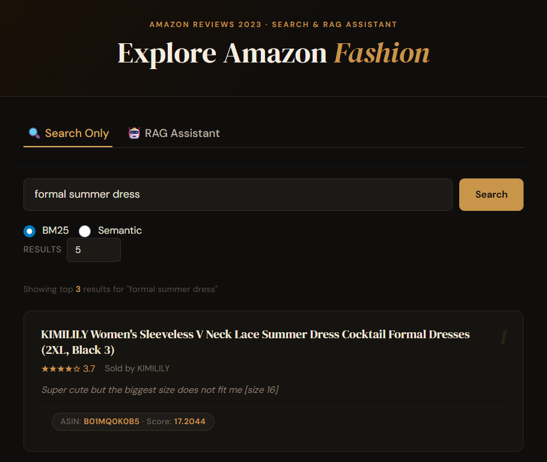
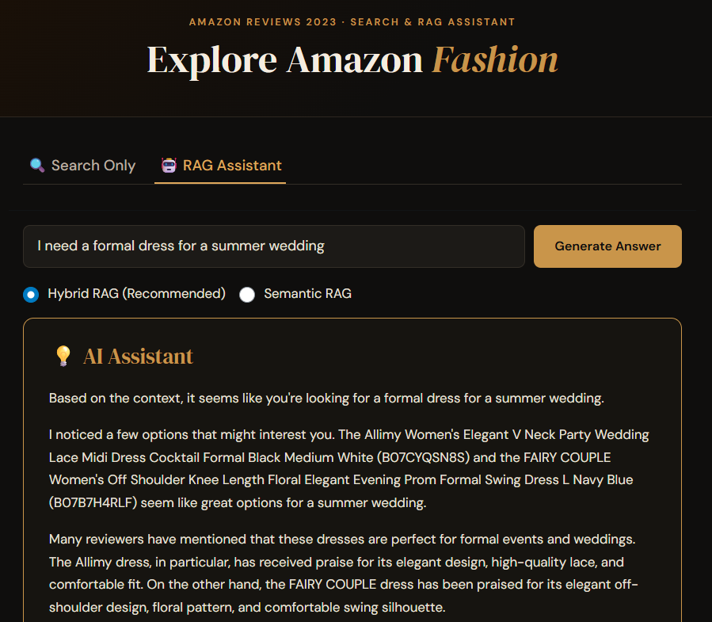

## Overview

An end-to-end Retrieval-Augmented Generation (RAG) system built over the
[Amazon Reviews 2023](https://amazon-reviews-2023.github.io/) dataset
(Amazon Fashion category). Given a natural language query, the system
retrieves the most relevant products and generates a grounded answer using
an LLM. Built with a teammate for DSCI 575.

**[GitHub](https://github.com/UBC-MDS/DSCI_575_project_hhkwok_ntruesde)**

The app supports three modes: BM25 keyword retrieval, semantic search via
sentence embeddings + FAISS, and hybrid RAG which combines both and feeds
the results to an LLM.

---

## RAG Pipeline

```         
User Query
    │
    ├─────────────────────┐
    ▼                     ▼
┌──────────┐        ┌──────────────┐
│  BM25    │        │   Semantic   │
│ Search   │        │  Search      │
│(rank_bm25│        │(all-MiniLM + │
│   )      │        │    FAISS)    │
└────┬─────┘        └──────┬───────┘
     │                     │
     │  Min-Max normalize  │
     │  scores separately  │
     └──────────┬──────────┘
                ▼
     Weighted Score Merge
     (default: 60% semantic,
               40% BM25)
     Merged & ranked by ASIN
                │
                │ Top-k=15 Documents
                ▼
     ┌────────────────────┐
     │   Context Builder  │
     │  ASIN · title ·    │
     │  rating · price ·  │
     │  store · review    │
     └──────────┬─────────┘
                │
                ▼
     ┌────────────────────┐
     │   LLM Generator    │
     │  llama-3.1-8b-     │
     │  instant (Groq)    │
     └──────────┬─────────┘
                │
                ▼
        Generated Answer
      + Retrieved Documents
```

---

## Data Pipeline

Rather than taking the first N rows, the corpus is built with a stratified
window-function sample in DuckDB across three axes — product rating bucket,
review text length, and verified purchase status — giving up to 36 strata
with 500 reviews each, capped at one review per product per stratum.

```python
# src/data_processing.py — stratify_corpus (simplified)
con = duckdb.connect()
con.execute(f"""
    COPY(
        WITH one_per_product AS (
            SELECT *,
                ROW_NUMBER() OVER (
                    PARTITION BY rating_bucket, len_tier, verified_purchase, parent_asin
                    ORDER BY helpful_vote DESC, random()
                ) AS product_rank
            FROM labelled
        ),
        ranked AS (
            SELECT *,
                ROW_NUMBER() OVER (
                    PARTITION BY rating_bucket, len_tier, verified_purchase
                    ORDER BY helpful_vote DESC, random()
                ) AS stratum_rank
            FROM one_per_product
            WHERE product_rank = 1
        )
        SELECT * FROM ranked
        WHERE stratum_rank <= 500
""")
con.close()
```

Fields for BM25 and semantic retrieval are built separately with different
field weighting strategies. BM25 up-weights structured metadata heavily;
semantic encoding uses a lighter boost since the embedding model handles
meaning more holistically:

```python
def build_bm25_text(corpus):
    # product_title × 3, review_title × 2, then store + review body
    return (
        corpus["product_title"].fillna("").astype(str) * 3 + " " +
        corpus["review_title"].fillna("").astype(str) * 2 + " " +
        corpus["store"].fillna("").astype(str) + " " +
        corpus["review_body"].fillna("").astype(str)
    )

def build_semantic_text(corpus):
    # product_title × 2 + review body
    return (
        corpus["product_title"].fillna("").astype(str) * 2 + " " +
        corpus["review_body"].fillna("").astype(str)
    )
```

---

## Retrieval

**BM25** tokenizes with lowercase, punctuation removal, and stopword
filtering. Vectorized preprocessing over the full corpus runs 3–5× faster
than row-wise apply.

**Semantic search** encodes with `all-MiniLM-L6-v2` (L2-normalized for
cosine similarity via `IndexFlatIP`) and retrieves with MMR
(`fetch_k=50`, return `k=15`) to balance relevance and diversity, then
aggregates to the product level by averaging the top-3 chunk scores per ASIN.

**Hybrid** normalizes both score sets to [0, 1] independently, then merges:

```python
hybrid_score = (0.6 × semantic_score) + (0.4 × bm25_score)
```

---

## RAG Chain

Both the semantic and hybrid chains share the same context builder, prompt
template, and LLM. The context builder formats each retrieved document into
a structured block:

```python
def build_context(docs: list) -> str:
    return "\n\n".join(
        f"Product ASIN: {doc.metadata.get('parent_asin', 'N/A')}\n"
        f"Title: {doc.metadata.get('product_title', 'N/A')}\n"
        f"Rating: {doc.metadata.get('rating', 'N/A')}/5\n"
        f"Average Rating: {doc.metadata.get('average_rating', 'N/A')}/5\n"
        f"Price: {doc.metadata.get('price', 'N/A')}\n"
        f"Store: {doc.metadata.get('store', 'N/A')}\n"
        f"Review: {doc.page_content}\n"
        for doc in docs
    )
```

The chain wires retriever → context builder → prompt → LLM using LangChain
LCEL:

```python
chain = (
    {
        "context": hybrid_retriever | build_context,
        "question": RunnablePassthrough()
    }
    | prompt_template
    | llm
    | StrOutputParser()
)
```

The system prompt instructs the model to answer using only the provided
review context, cite ASINs in recommendations, highlight relevant product
details like fit and durability, compare products when multiple are relevant,
and explicitly acknowledge when context is insufficient rather than
hallucinating.

---

## Example

**Search mode** — query: *"formal summer dress"*

> KIMILILY Women's Sleeveless V Neck Lace Summer Dress ★★★★☆ 3.7
> "Super cute but the biggest size does not fit me" · Score: 17.2



**RAG mode** — query: *"I need a formal dress for a summer wedding"*



> Based on the context, the Allimy Women's Elegant V Neck Party Wedding
> Lace Midi Dress (B07CYQSN8S) and the FAIRY COUPLE Women's Off Shoulder
> Floral Evening Prom Dress (B07B7H4RLF) seem like great options...

---

## Evaluation

Retrieval is evaluated with Precision@k, Recall@k, and MRR using
runtime-derived ground truth — for each test query, relevant ASINs are
identified by regex-matching `product_title` in the cleaned corpus, so
the ground truth set regenerates automatically when the corpus is rebuilt.

An A/B experiment compared the shipped model (`llama-3.1-8b-instant`)
against a larger challenger (`llama-3.3-70b-versatile`) with identical
retrieved context and prompt, so any output differences are attributable
solely to the model.

---

## What I Learned

- Stratified sampling over a 2.5M review corpus made a meaningful difference
  to retrieval quality compared to a naive slice — the naive approach
  over-represented popular products and short reviews
- MMR at retrieval time noticeably reduced result redundancy for broad queries
  where many reviews describe the same product
- Holding context and prompt constant in the A/B experiment was the right
  design — it surfaced real model capability differences rather than
  confounding from retrieval variance