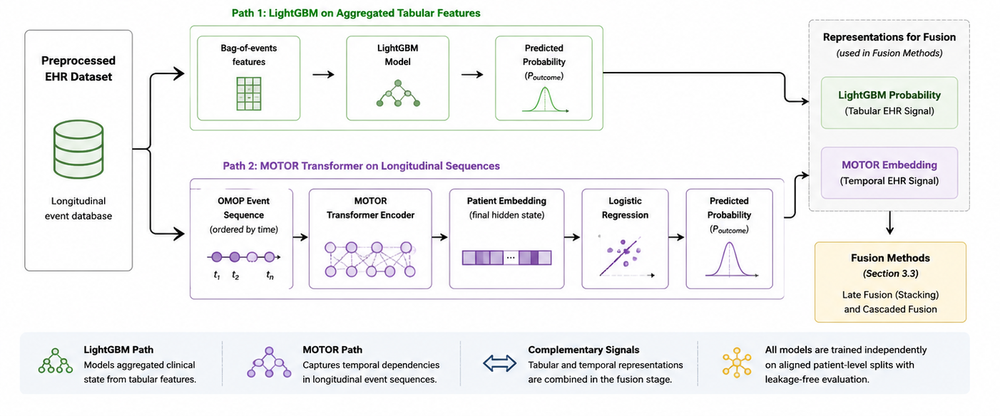
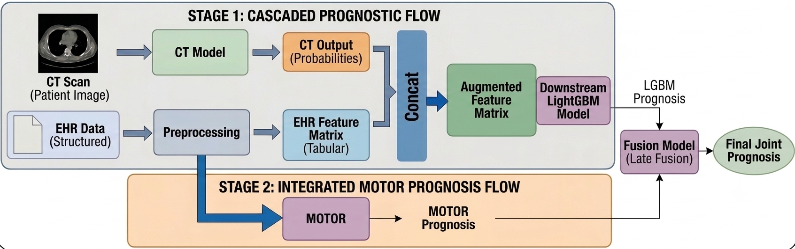

::: {.callout-note}
## Project Context

This project was completed as part of my Master's capstone in partnership with **Tandem Research**, where I led a four-person team through the full pipeline design, EHR/GBM modeling, fusion strategy, and infrastructure. Tandem partners with healthcare organizations on applied data science initiatives, and some details of this project — including the specific clinical dataset used, exact performance results, and certain visual outputs (e.g. model explainability figures) — are private and protected under a non-disclosure agreement. This post describes the methodology, modeling approach, and high-level findings at a level appropriate for public sharing.
:::

## Overview

Clinicians often lack reliable tools to identify which patients are at the highest risk of death or hospital readmission following a serious diagnosis. Most existing machine learning approaches in healthcare rely on a single data source — either structured electronic health records (EHR) or medical imaging — but rarely combine both. This means models built on a single modality may miss important context available elsewhere in a patient's record.

Working with a healthcare-focused research partner, our team set out to answer:

> How can structured EHR data and 3D medical imaging be combined into a multimodal machine learning framework to predict patient mortality and hospital readmission?

We built a reproducible, end-to-end pipeline that integrates tabular clinical history with volumetric imaging data, explored multiple ways of fusing those signals together, and prioritized interpretability throughout, since our partner's goal was a research tool that clinicians and data scientists could trust and build on, not a black box.

## Approach

### EHR Modeling

Before modeling, raw clinical history goes through a standardized preprocessing pipeline: cohorts are defined, records are standardized into a common data format, outcome labels are aligned to a fixed prediction window with a temporal offset to avoid leakage, and patient features are constructed.

Structured clinical history was modeled two complementary ways:

- A **gradient-boosted tree model (LightGBM)** trained on aggregated, ontology-based event counts — effective at capturing nonlinear interactions in tabular clinical features.
- A **transformer-based sequence model** trained directly on longitudinal clinical event sequences, producing contextual patient embeddings that capture how a patient's history unfolds over time.

Both paths were designed with leakage-free, patient-level data splits and a temporal offset between recorded history and prediction time.

To understand how sensitive each model is to the amount of history it has access to, we ran a **lookback-window experiment**, retraining both LightGBM and the transformer under restricted history windows (1 year, 5 years, 10 years, and full available history) and evaluating performance across all downstream tasks. This was paired with a **SHAP-based domain analysis** that aggregated feature attributions by clinical domain (e.g. conditions, medications, procedures) to see how the relative importance of different types of clinical evidence shifts as available history shrinks — a proxy for how the model would behave on patients with fragmented or incomplete records, a common real-world scenario.

### Imaging Modeling

Medical imaging studies were processed through a slice-based encoder followed by a sequential aggregation model to produce a single per-patient risk score.

Each CT volume's axial slices were rendered as three clinically-relevant HU windows stacked as RGB channels, then passed through a pretrained ResNetV2 convolutional backbone to extract a per-slice feature vector. Features were cached to disk so the expensive convolutional pass only needed to run once per scan, decoupling it from downstream experimentation. Per-scan feature sequences were padded or truncated to a fixed length, with an accompanying mask and a positional feature encoding each slice's physical depth, before being passed into a recurrent sequence model (LSTM/GRU, with a Transformer variant also supported) that aggregated across slices into a single risk score per study.

Training used mixed-precision (bfloat16) to keep the large per-slice feature dimensionality numerically stable, weighted sampling to address class imbalance across the low-prevalence clinical outcomes, and resumable checkpointing so long-running training jobs could survive interruption on cloud compute without losing progress.

### Fusion Strategies

We evaluated two ways of combining imaging and EHR signals:

1. **Late fusion (stacking):** independent model outputs from each modality are combined via logistic regression, allowing systematic comparison of single-modality, pairwise, and full multimodal configurations.

2. **Cascaded fusion (feature-level integration):** imaging-derived risk scores are injected directly as a feature into the tabular EHR pipeline, allowing a downstream model to learn nonlinear interactions between imaging and clinical variables natively.

No single fusion strategy dominated across every clinical task — the EHR-only models were consistently strong, and feature-level (cascaded) integration of imaging signal tended to outperform decision-level fusion, suggesting that *how* modalities are combined matters as much as *whether* they're combined at all.

### Interpretability

Because the project's primary stakeholder cared as much about *why* a model made a prediction as the prediction itself, explainability was built into the pipeline rather than added after the fact. Techniques used included:

- **TreeSHAP** values to identify which clinical features drove individual gradient-boosted model predictions, with features mapped back to human-readable clinical concepts, and aggregated by clinical domain to compare contribution patterns across tasks and lookback windows.
- **Integrated Gradients and embedding probing** to interpret the transformer-based sequence model's hidden representations.
- **Grad-CAM and slice-importance analysis** on the imaging model, to surface which regions of a scan most influenced a prediction.
- A **censoring/lookback analysis** that systematically restricted how much patient history a model could see, in order to measure how predictive performance degrades as historical context shrinks.

The specific outputs of these analyses (e.g. SHAP plots, Grad-CAM heatmaps) are part of the project's private deliverables and aren't included here, but the methodology itself is described above.

## Data Product

Rather than building a standalone dashboard, we delivered a cloud-based, queryable pipeline: every model run, prediction, and explainability output is logged and stored so that our research partner's team can query results directly and extend the pipeline to new datasets without rebuilding infrastructure from scratch. The emphasis throughout was on reproducibility and modularity — each pipeline component (imaging featurization, EHR modeling, fusion, explainability) can be rerun or swapped independently.

## Key Takeaways

- EHR-based models were consistently strong predictors of mortality and readmission risk on their own.
- Imaging signal added the most value when integrated at the feature level rather than the decision level.
- No single fusion configuration was best across every task — the right approach depends on the specific clinical question being asked.
- Building interpretability into the pipeline from the start (rather than retrofitting it) made the results far more actionable for clinical stakeholders.

## Future Directions

Recommended next steps include evaluating the full dataset at scale, restricting model inputs to information available earlier in a patient's care pathway to improve real-world deployment practicality, completing the historical-lookback experiments at full scale, and containerizing the pipeline to improve reproducibility for future projects.