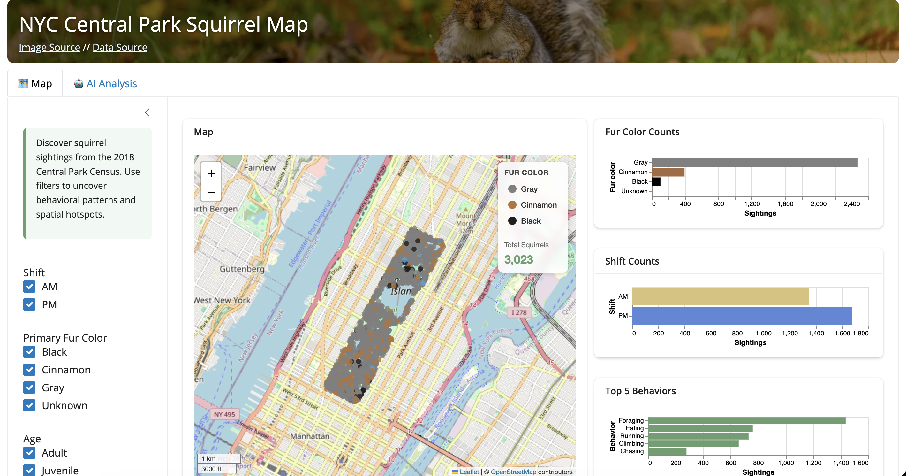
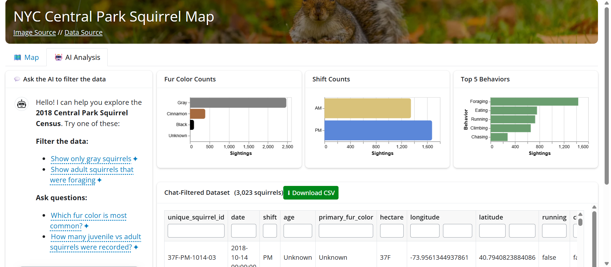

## Overview

An interactive data visualization dashboard for exploring behavioral patterns
and spatial distributions of squirrels in New York City's Central Park, built
using the [2018 Central Park Squirrel Census](https://data.cityofnewyork.us/Environment/2018-Central-Park-Squirrel-Census-Squirrel-Data/vfnx-vebw).

**[Live App](https://elsereneee-nycsquirrelmap.share.connect.posit.cloud) · [GitHub](https://github.com/UBC-MDS/DSCI-532_2026_24_NYC-squirrels)**

---

## What the Dashboard Does

The app has two tabs:

**Map tab** — a Folium map of all sightings with a sidebar to filter by
shift (AM/PM), fur color, age, and behavior. Three Altair bar charts update
alongside the map showing fur color counts, shift counts, and top 5 behaviors.
A downloadable data table sits below.

**AI Analysis tab** — a natural language chat interface powered by GPT-4.1
via `querychat`. Ask questions like *"show only gray squirrels that were
foraging"* and the charts and table update to reflect the filtered result.





---

## Architecture

Data is preprocessed once into a Parquet file and a GeoJSON file, then
queried at runtime with DuckDB — keeping the app fast without loading the
full dataset into memory on every filter change.

```python
con = duckdb.connect()
con.execute(f"CREATE VIEW squirrels AS SELECT * FROM read_parquet('{OUT_PAR}')")
```

Filtering is driven by a single reactive DuckDB query that builds a WHERE
clause from the sidebar inputs:

```python
@reactive.calc
def filtered_df() -> pd.DataFrame:
    conditions = []
    if selected_shift:
        conditions.append(f"shift IN ({placeholders})")
    if selected_fur:
        conditions.append(f"primary_fur_color IN ({placeholders})")
    if valid_behavior:
        conditions.append(f"({' OR '.join(f'{c} = TRUE' for c in valid_behavior)})")

    where = f"WHERE {' AND '.join(conditions)}" if conditions else ""
    return con.execute(f"SELECT ... FROM squirrels {where}").df()
```

The Folium map renders inside an `<iframe>` using `srcdoc`, with a custom
HTML/JS legend that syncs fur color selections back to Shiny via
`Shiny.setInputValue`.

Charts are built with Altair and embedded using `vegaEmbed` rather than
Shiny's default rendering, which allows `width="container"` to make them
fully responsive.

---

## AI Chat Integration

The chat tab uses `querychat` with a `ChatGithub` client (GPT-4.1). The
model translates natural language into filtered DataFrames, which then
drive the same chart and table components used in the map tab.

```python
qc = QueryChat(
    _chat_base_df,
    "squirrels",
    client=ChatGithub(model="gpt-4.1"),
)
```

---

## Testing

Unit tests with **pytest** cover data processing logic; end-to-end dashboard
behavior is verified with **Playwright**:

```bash
pip install pytest-playwright
playwright install
pytest tests/
```

---

## What I Learned

- DuckDB as a query layer over Parquet is a clean pattern for dashboard
  backends — filtering stays fast and the query logic is easy to read and test
- Embedding Folium inside a Shiny iframe works well but requires careful
  JS bridging to push legend clicks back into Shiny's reactive graph
- `querychat` abstracts a lot of the LLM-to-dataframe plumbing, but prompt
  design still matters — the greeting suggestions meaningfully improved
  the quality of first queries from users unfamiliar with the data