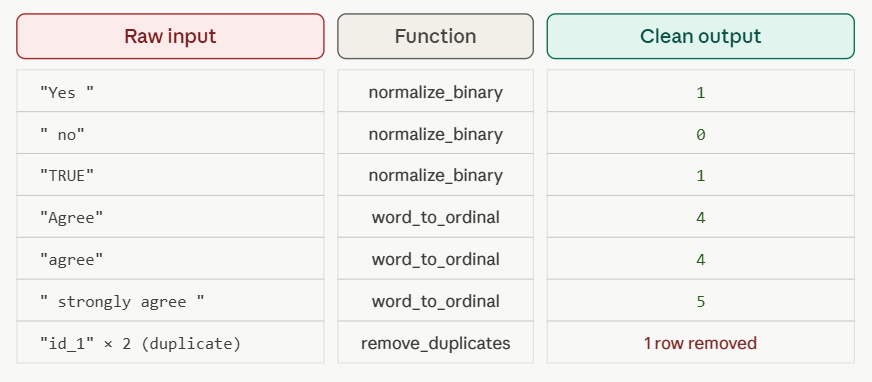
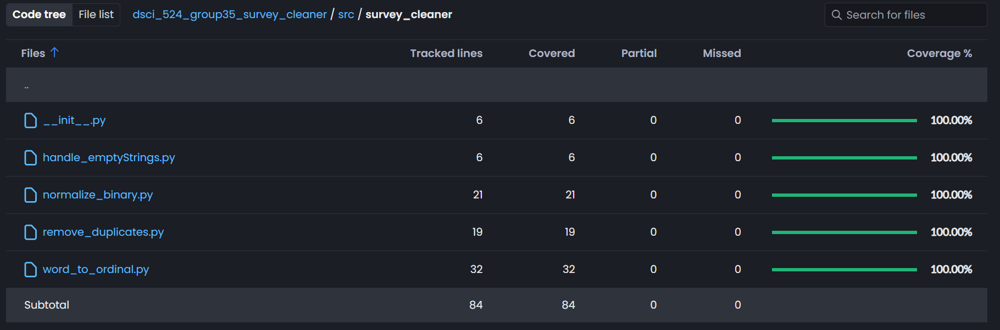

## Overview

A lightweight, open-source Python package for cleaning and preprocessing
survey data, built through the full development lifecycle — from API design
and test-driven development to CI/CD automation and distribution on TestPyPI.

**[TestPyPI](https://test.pypi.org/project/survey-cleaner/) · [GitHub](https://github.com/UBC-MDS/DSCI_524_group35_survey_cleaner) · [Docs](https://ubc-mds.github.io/DSCI_524_group35_survey_cleaner/)**

---

## The Problem

Survey data is messy in predictable ways: duplicate responses from the same
respondent, inconsistent whitespace, binary answers recorded as "Yes"/"No" or
"True"/"False", and ordinal responses stored as words instead of numbers.
Most teams handle this with one-off scripts that aren't reusable or tested.
SurveyCleaner provides a consistent, well-tested API for the most common
survey cleaning tasks.

---

## Functions

- **`remove_duplicates`** — keeps only the latest response from each respondent
- **`handle_emptyStrings`** — strips and collapses whitespace, handles None values
- **`normalize_binary`** — converts Yes/No, True/False, T/F to 1/0
- **`word_to_ordinal`** — maps ranking words (or Likert scale text) to numeric values

---

## Usage

### Remove Duplicate Responses

```python
from survey_cleaner import remove_duplicates

responses = pd.DataFrame({
    'respondent_id': [1, 2, 1, 3],
    'completed_at': ['2024-01-01 10:00', '2024-01-01 11:00',
                     '2024-01-01 12:00', '2024-01-01 13:00'],
    'answer': ['Yes', 'No', 'Maybe', 'Yes']
})

clean_responses = remove_duplicates(responses, 'respondent_id', 'completed_at')
```

### Normalize Binary Responses

```python
from survey_cleaner import normalize_binary

df = pd.DataFrame({'response': ['Yes', 'No', 'Yes']})
df['response'] = df['response'].apply(normalize_binary)
# Result: [1, 0, 1]
```

### Convert Ordinal Responses to Numeric

```python
from survey_cleaner import word_to_ordinal

feedback = pd.Series(["strongly agree", "agree",
                      "neither agree nor disagree", "disagree"])

# Using built-in Likert scale
word_to_ordinal(feedback, likert="agreement")

# Or provide a custom mapping
word_to_ordinal(feedback, mapping={"strongly agree": 5, "disagree": 2})
```

### Clean Whitespace

```python
from survey_cleaner import handle_emptyStrings

df['comments'] = df['comments'].apply(handle_emptyStrings)
```

---

## Example


---

## CI/CD Pipeline

Four automated workflows keep the package built, tested, and published:

| Workflow | Trigger | Purpose |
|----------|---------|---------|
| `build.yml` | Push/PR to main | Runs tests and builds package |
| `deploy.yml` | Push to main | Deploys to TestPyPI after tests pass |
| `quartodoc.yml` | Push/PR to main | Builds API documentation |
| `quartodoc-publish.yml` | Push to main | Publishes docs to GitHub Pages |

---

## Test Coverage

Built with test-driven development — tests were written before implementation
for core functions. Final coverage: **100%** across modules, tracked via
[Codecov](https://codecov.io/github/ubc-mds/dsci_524_group35_survey_cleaner).



---

## Installation

```bash
pip install --index-url https://test.pypi.org/simple/ \
            --extra-index-url https://pypi.org/simple/ \
            survey_cleaner
```

---

## What I Learned

- Designing a clean public API is harder than writing the implementation —
  early versions had unclear method signatures that we refactored based on
  usability testing with teammates
- CI/CD dramatically reduces maintenance overhead; after setup, releases
  were essentially one-click
- Test-driven development caught logic bugs before any code ran in production,
  particularly in the edge cases for `normalize_binary` and `word_to_ordinal`
